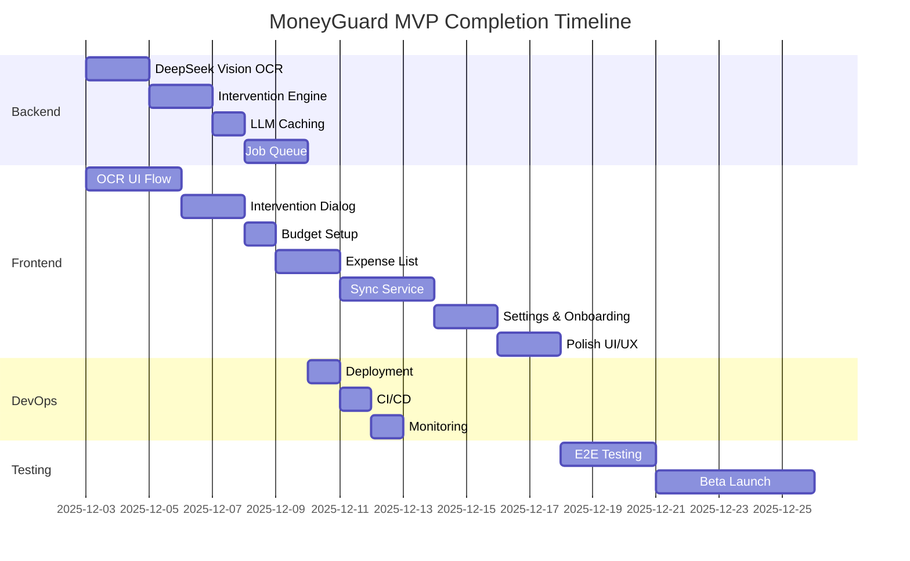

# MoneyGuard MVP Completion Plan

## Current State Assessment

Based on exploration, the project is **approximately 40% complete** relative to the MVP defined in the 4-week sprint plan. The foundation is solid but key features are missing.

### ✅ **Completed Components**

**Backend (FastAPI)**
- [x] Project structure and configuration
- [x] Database models (User, Expense, Budget, Category)
- [x] Alembic migrations (initial schema + updates)
- [x] JWT authentication (login/register)
- [x] CRUD endpoints for expenses, budgets
- [x] Basic intervention service (mocked LLM integration)
- [x] Mock OCR service

**Frontend (Flutter)**
- [x] Project structure with Clean Architecture
- [x] Authentication screens (login, register)
- [x] Dashboard screen with basic UI
- [x] Riverpod state management
- [x] Hive local storage setup
- [x] GoRouter navigation
- [x] Quick add expense sheet (UI)

**Infrastructure**
- [x] Environment configuration template
- [x] Database schema defined

### ⚠️ **Partially Implemented**

**Backend**
- [ ] OCR service integration with DeepSeek Vision (currently mocked)
- [ ] Intervention engine with proper 3-gate logic (partially implemented)
- [ ] Budget calculations (spent amount queries need testing)
- [ ] Caching for LLM responses
- [ ] Background job queue for sync

**Frontend**
- [ ] OCR receipt scanning UI flow (camera, gallery, confirmation)
- [ ] Intervention dialog (red/yellow alerts)
- [ ] Budget setup wizard
- [ ] Expense list screen with filtering
- [ ] Sync service (background, conflict resolution)
- [ ] Settings screen (AI mode, thresholds)

**DevOps**
- [ ] Deployment to Railway (backend + PostgreSQL)
- [ ] CI/CD pipeline (GitHub Actions)
- [ ] Monitoring (logs, error tracking)

### ❌ **Missing (Critical for MVP)**

1. **OCR Integration** – Real DeepSeek Vision API integration for receipt scanning.
2. **Intervention UI** – Dialog that shows AI message and captures user decision.
3. **Sync Engine** – Offline-first sync between Hive and backend.
4. **Budget Awareness** – Calculate safe-to-spend and trigger interventions.
5. **Polish** – Error handling, loading states, empty states, onboarding.

---

## Remaining Tasks by Component

### **Backend (Priority: High)**

| Task | Description | Est. Hours | Dependencies |
|------|-------------|------------|--------------|
| 1. Integrate DeepSeek Vision OCR | Replace mock OCR with DeepSeek Vision API (image → text → structured data) | 6 | None |
| 2. Enhance intervention engine | Implement full 3-gate logic with budget/upcoming bills | 6 | Budget queries |
| 3. Add LLM caching | Redis or in-memory cache to reduce costs (both OCR and intervention) | 4 | Intervention engine |
| 4. Add background job queue | For async tasks (email, notifications) | 8 | Database |
| 5. Improve error handling & logging | Structured logs, Sentry integration | 3 | None |
| 6. Write unit tests | Core services (intervention, OCR, auth) | 6 | All services |

### **Frontend (Priority: High)**

| Task | Description | Est. Hours | Dependencies |
|------|-------------|------------|--------------|
| 1. OCR receipt scanning flow | Camera/gallery picker, image upload, confirmation screen | 10 | Backend OCR endpoint |
| 2. Intervention dialog | Modal with severity colors, AI message, proceed/cancel buttons | 6 | Intervention API |
| 3. Budget setup wizard | Step‑by‑step UI to create monthly budget | 4 | Budget API |
| 4. Expense list screen | Pagination, filtering by date/category, swipe to delete | 8 | Expense API |
| 5. Sync service | Background sync, conflict resolution, offline queue | 10 | Hive, API client |
| 6. Settings screen | AI mode selector, intervention threshold, logout | 4 | User API |
| 7. Onboarding flow | Welcome screens, permission explanations | 6 | None |
| 8. Polish UI/UX | Loading states, empty states, animations, dark mode | 8 | All screens |

### **Infrastructure & DevOps (Priority: Medium)**

| Task | Description | Est. Hours | Dependencies |
|------|-------------|------------|--------------|
| 1. Deploy backend to Railway | Set up PostgreSQL, environment variables | 2 | Backend ready |
| 2. Set up CI/CD | GitHub Actions for linting, testing, deployment | 4 | Repository |
| 3. Configure monitoring | Railway logs, error tracking (Sentry optional) | 2 | Deployment |
| 4. Database backups | Automated daily backups | 1 | Railway |
| 5. Cost monitoring | Track LLM usage (DeepSeek text + vision), set alerts | 1 | DeepSeek integration |

### **Testing & Quality (Priority: Medium)**

| Task | Description | Est. Hours | Dependencies |
|------|-------------|------------|--------------|
| 1. End‑to‑end testing | Critical user flows (login, add expense, intervention) | 10 | Feature complete |
| 2. Performance testing | Load testing on intervention endpoint | 4 | Backend deployed |
| 3. Beta testing | Recruit 10 users, collect feedback | 8 | MVP feature complete |

---

## Timeline & Dependencies

**Total estimated development time**: ~80‑100 hours (2‑3 weeks of full‑time work).

**Critical path**: OCR integration → Intervention engine → Sync service → Beta testing.

---

## Risk Assessment

| Risk | Impact | Probability | Mitigation |
|------|--------|-------------|------------|
| DeepSeek Vision accuracy/cost | High | Medium | Test with sample receipts; cache results; fallback to manual entry |
| LLM costs exceed budget | Medium | Medium | Implement aggressive caching; use cheaper model for gate 3; monitor usage |
| Sync conflicts cause data loss | High | Low | Simple “server wins” policy; backup local data |
| User retention low | High | Medium | Focus on intervention value; iterate based on beta feedback |
| Time overrun | Medium | High | Prioritize MVP features; defer nice‑to‑haves |

**DeepSeek Vision Considerations**:
- **Pros**: Single API provider, consistent quality, likely better at handwritten receipts.
- **Cons**: Additional cost per image (~$0.001‑0.01 per receipt), network dependency.
- **Decision**: Use DeepSeek Vision for MVP; later evaluate switching to on‑device ML Kit if costs become prohibitive.

---

## Success Metrics (MVP Launch)

1. **Functional**: All 8 MVP endpoints working; app installs and runs on Android.
2. **Usability**: User can log an expense via OCR or manual entry in under 10 seconds.
3. **Intervention**: AI warning triggers for purchases >2000 DOP when budget is tight.
4. **Offline**: App works without internet; syncs when back online.
5. **Cost**: LLM usage (text + vision) < $10/month for 10 users.
6. **Feedback**: At least 7/10 beta users provide positive feedback.

---

## Next Immediate Steps (Week 1)

1. **Set up DeepSeek Vision OCR integration** (backend + frontend)
   - Backend: Integrate DeepSeek Vision API, parse extracted text into amount/merchant/date.
   - Frontend: Add camera/gallery picker, upload image, display extracted data.
2. **Complete intervention engine**
   - Implement gate 1 (amount threshold), gate 2 (safe‑to‑spend), gate 3 (AI).
   - Add caching for identical contexts.
3. **Build intervention dialog**
   - UI component that shows AI message and records user decision.
4. **Deploy backend to Railway**
   - Get a live API for frontend testing.

---

## Recommendations

1. **Focus on core value** – Ensure the intervention system is compelling and reliable.
2. **Keep it simple** – Avoid scope creep; postpone advanced features (voice, analytics, multi‑currency).
3. **Test early with real users** – Even a rough prototype can validate the concept.
4. **Monitor costs** – DeepSeek usage can spike; set up alerts.

---

## Ready to Proceed?

This plan provides a clear roadmap to a shippable MVP. The next logical step is to start with **DeepSeek Vision OCR integration** (highest impact, moderate complexity). Alternatively, we could begin with **intervention engine improvements** if you prefer to strengthen the core AI logic first.

Let me know which component you’d like to tackle first, and I’ll switch to **Code Mode** to implement it.